# Ubiquitous Computing

> A smart box prototype for the productive flex worker.

Modern day workers [spend more time in the office](http://www.motherjones.com/politics/2011/06/speed-up-american-workers-long-hours/), but if they’re not working smarter, they aren’t doing much for their employers. This might sound like a simple insight, but companies that understand what drives productivity get the most out of their talent and, as a result, produce better products, offer greater service and, ultimately, generate higher revenue.

From Carol Jones & Kelly Gordon's research _Efficient Lighting Design and Office Worker Productivity_: "Satisfaction with the office lighting influenced other areas of preference. People who were more satisfied with their lighting [...] said they were happier, more comfortable and more satisfied with their environment and their work."

So if lighting is a proven stimulator (or unstimulator), why are we neglecting it's effects? The same can actually be said about sound.

Julian Treasure, chairman of [The Sound Agency](https://www.thesoundagency.com/), states, “Noise is a major threat to our health and productivity – but until now we have been largely unconscious of its effects because of our obsession with how things look. By addressing noise concerns, we can transform the productivity and well-being of office workers, patients in hospitals and children in schools, among many others.”

Isn't it about time we strive for a more positively influenced healthy worker?

## The office

Walking around CLEVER°FRANKE's office you will notice very different atmospheres in lighting and sound depending on the surroundings and density of people. What could be a (subconscious) productivity sweet spot in the morning could be the opposite in the afternoon. The entire second floor has a glass ceiling which can introduce all kinds of lighting scenarios and there are regularly stand-up meetings, discussions, and 'watercooler' conversations going on.

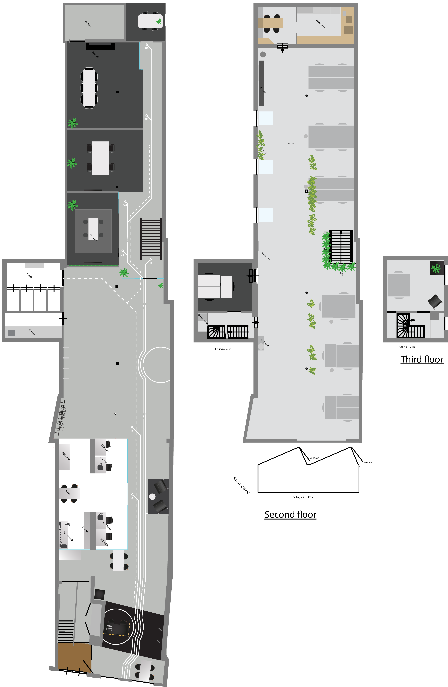

## Prototype

The portable smart box as seen below tends to solve these problems mentioned above, by cleary indicating the (subconscious) lighting and sound conditions around you, on demand at a simple touch. Find out the state of your current spot or take it with you and test it along the way.

###### _First concept sketch, might slightly differ from the end result._

The interaction starts at the first glance at the box in it's inactive state. A button on the top side of the box features two partially visible sensors and a button. Pressing the button will result in the LED matrix being turned and the word 'light' will slowly scroll by as it doesn't fit in the 8x8 grid. After a short delay the lux sensor will start picking up the light (lux) intensity and visualise it on the matrix. It behaves sort of like an equalizer as seen below.

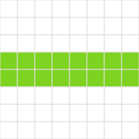

###### _The current light intensity is a productivity hotspot!_

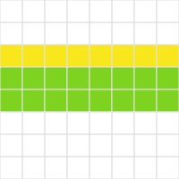

###### _Yellow at the top side indicates it's a but too bright, but not too much to worry about._

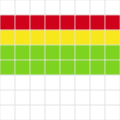

###### _It's becoming pretty bright over here, this might influence you._

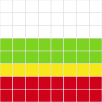

###### _Alternatively, visualising the other side indicates it is too dark. This means it is **very** dark and it may effect your productivity._

The above is the result of a single value being visualised. The light sensor will capture 20 delayed measurements and each measurement has it's own visualisation. Meaning, if the light intensity is fluctuating in short time spans, you can see the changes live on the LED matrix. After the 20 results it will end with an emoji conclusion, which can be one of the following emoji based on the cumulative average.

###### _The results were poor, you are working in a dark spot._

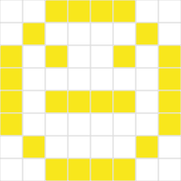

###### _It's not perfect but still okay-ish._

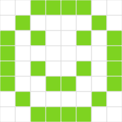

###### _You are working in perfect conditions._

Now that we have drawn a conclusion about the light intensity, we move onwards to sound. You've guessed it, "sound" will scroll by and a similar but slightly different visualisation process is about to start.

Because there is not really such a thing as 'too quiet to concentrate', it's not valuable visualize both ways like with the light intensity (too dark or bright). Therefor, the equalizer pattern will start from the bottom en move upwards the more noise there is.

###### _No destracting sound levels._

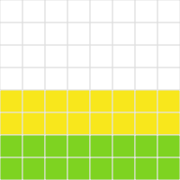

###### _Questionable noise in the background_

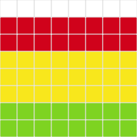

###### _You should not work with this amount of noise present._

The emoji conclusion based on the average of results will also appear here when done.

When done the box will go inactive again to not further disturb the user's attention.
To start again, simply press the button on the top part of the box.

### On-the-fly mode

If you don't want to just check your current's work spot condition, but you'd rather look for a proper one, it's possible to press a different button on the side to enable on-the-fly mode. This mode is not a sequence of visualisations in a set time frame, but a continuous loop of a combined visualisation of sound and light.

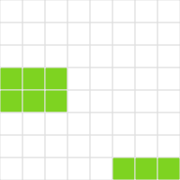

###### _On the left you see the light intensity in the same way as before, only smaller. Same goes for the sound visualisation on the right. Both seem to be very pleasant._

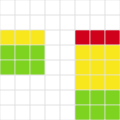

###### _Light appears to be slighty on the bright side while it's definitely noisy._

The loop will stop once you press the same button again and the box will go inactive.

And as mentioned before, whether you're checking the current state of your workspot or walking around finding one, you can start either process again by pressing the corresponding button.

### Key Components

#### NodeMCU ESP8266

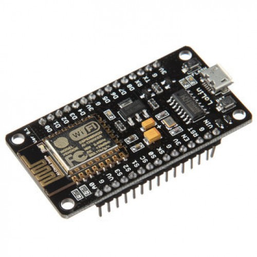

#### Bicolor LED Square Pixel Matrix

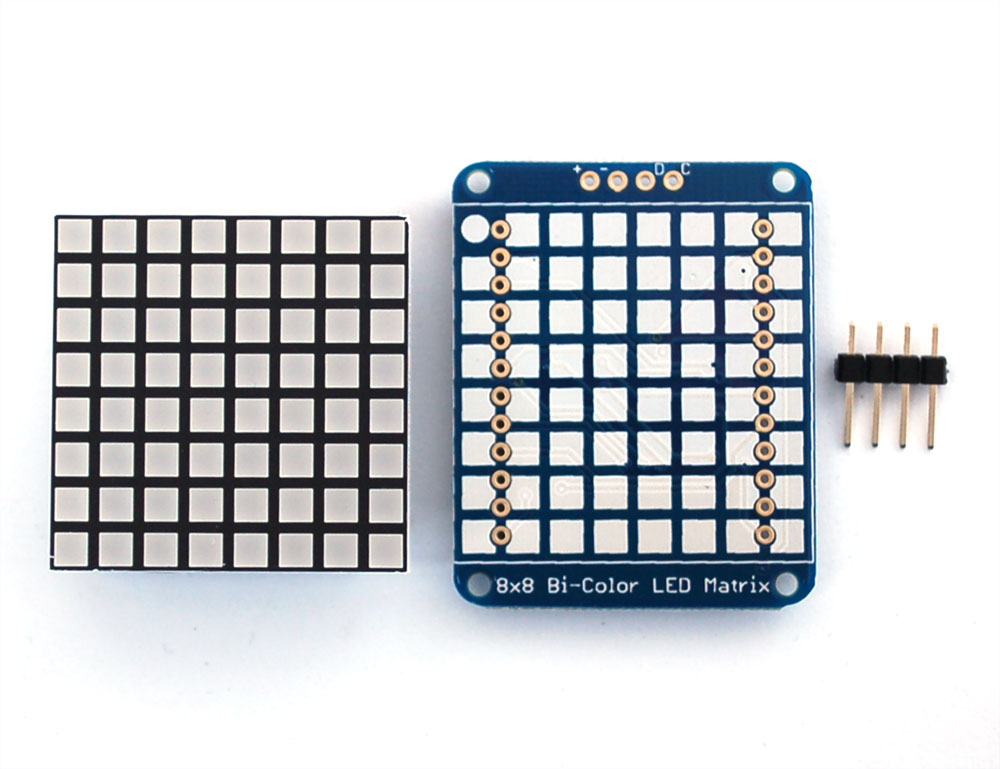

#### TSL2561 Digital Luminosity/Lux/Light Sensor

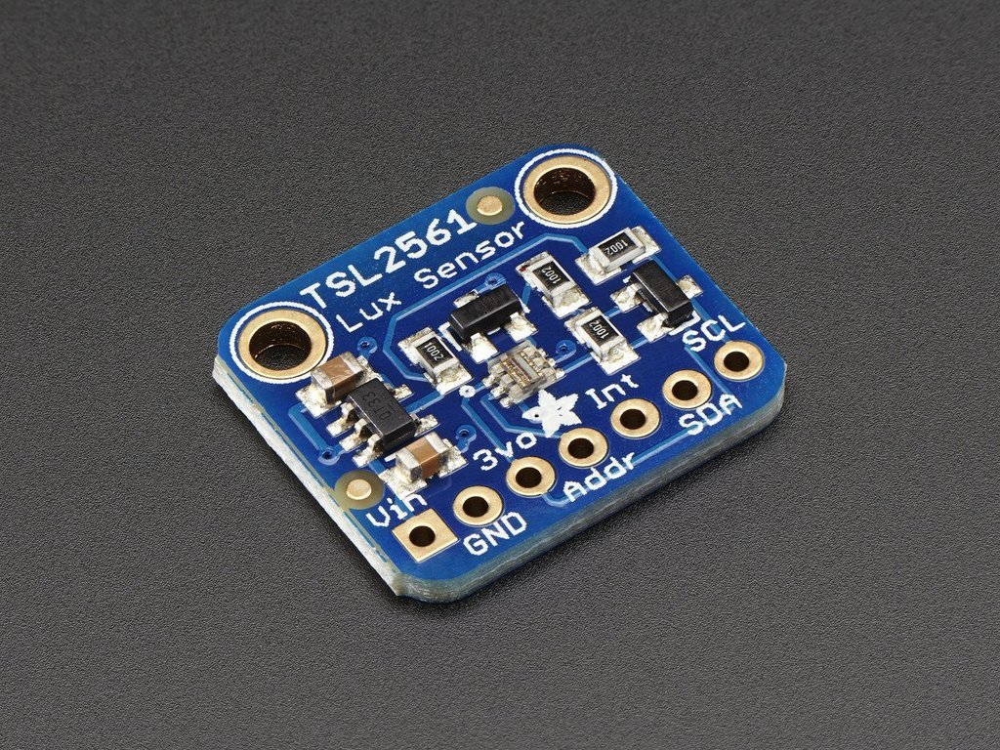

#### Electret Microphone

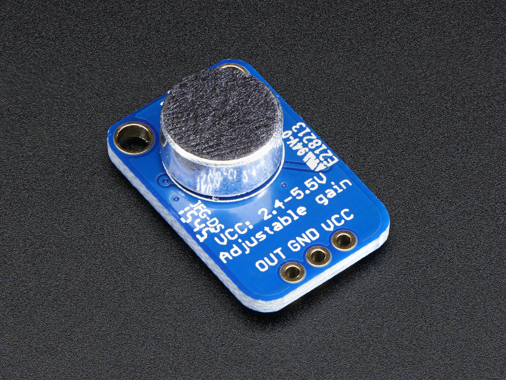

#### Square Force-Sensitive Resistor

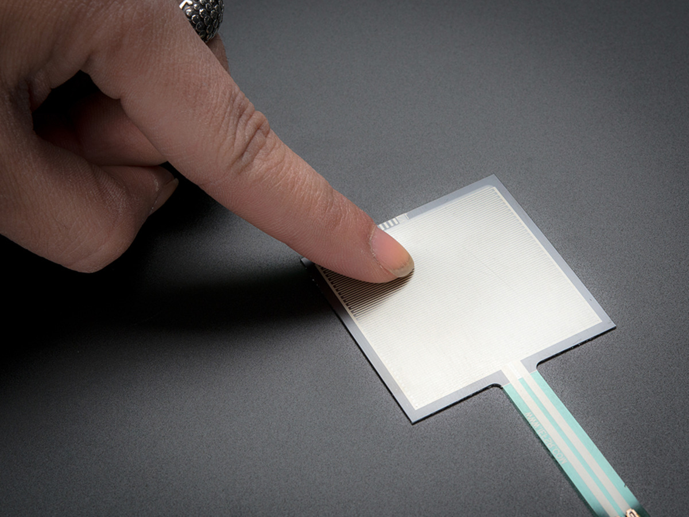

## References

Harrison, G. (ND). What Does Productivity Sound Like?. Retrieved from https://www.wired.com/insights/2013/08/what-does-productivity-sound-like/

Pacific Northwest National Laboratory (ND). Efficient Lighting Design and Office Worker Productivity [PDF file].
Retrieved from http://aceee.org/files/proceedings/2004/data/papers/SS04_Panel3_Paper10.pdf
